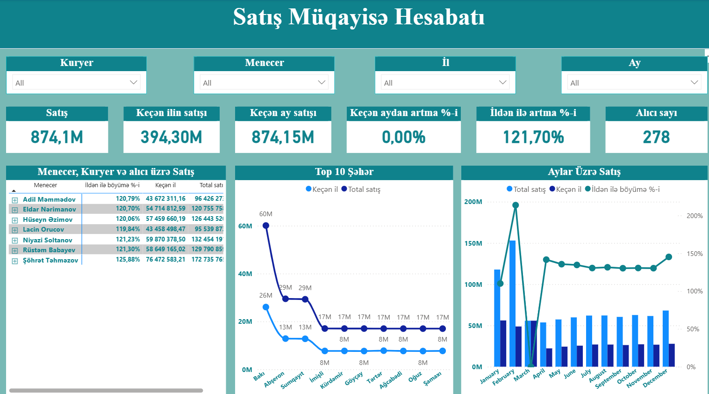

📊 Ümumi Göstəricilər 
- Cari satış: 874,15 milyon
- Keçən ilin satışları: 394,30 milyon
- Satış artımı: 121,70% illik artım
- Satış sayı: 278 əməliyyat
👥 Menecer, Kuryer və İl üzrə Satışlar
- Ən çox satış edən şəxslər: Eldar Talıbov, Hüseyn Orucov və digərləri — hər biri təxminən 102 milyon satışla 26.1% paya sahibdir.
🏙️ Şəhərlər üzrə Satışlar (Top 10)
- Bakı, Gəncə, Sumqayıt və digər şəhərlərdəki satışlar cari və keçən illə müqayisəli şəkildə xətt qrafikində göstərilib.
📅 Aylar üzrə Satışlar
- Yanvar–Dekabr ayları üzrə satış miqdarı (mavi sütunlar) və faiz dəyişimi (yaşıl xətt) təqdim olunub.
Bu hesabat satışların zamanla, bölgələrə və işçilərə görə necə dəyişdiyini izləməyə imkan verir.

🔍 İstifadə olunan komponentlər
- Kart vizualları: Ümumi satış, keçən ilin satışları, artım faizləri kimi göstəricilər üçün.
- Cədvəl vizualları: Menecer, kuryer və region üzrə satışların detallı təqdimatı.
- Xətt qrafiki: Şəhərlər üzrə satışların illik müqayisəsi.
- Sütun və xətt kombinə qrafiki: Aylar üzrə satış miqdarı və faiz dəyişimi

